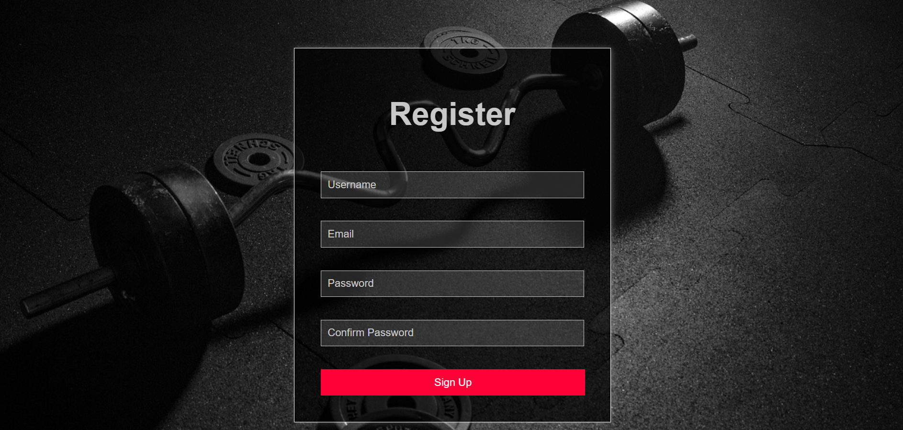
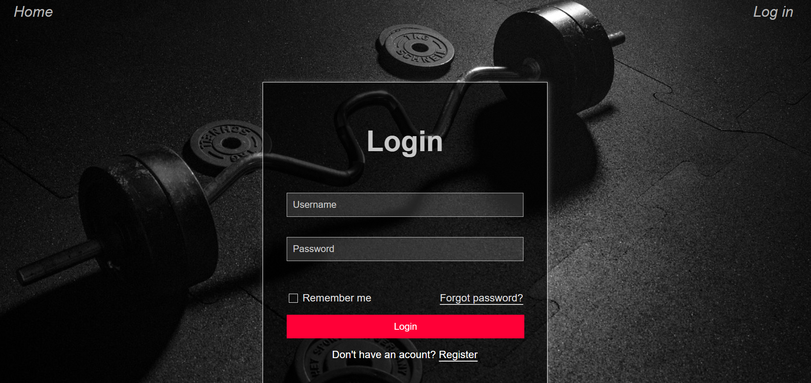
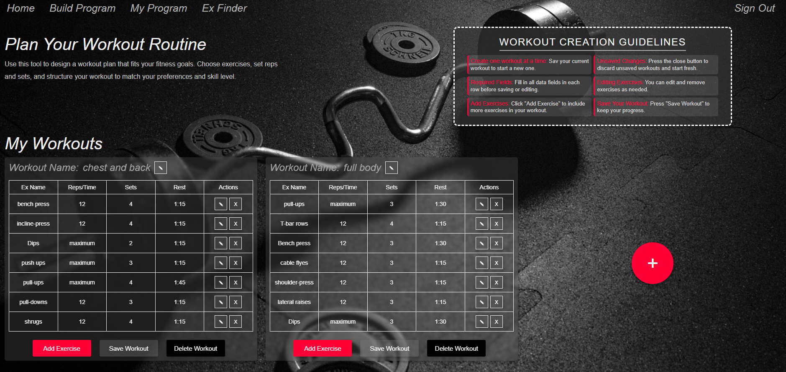
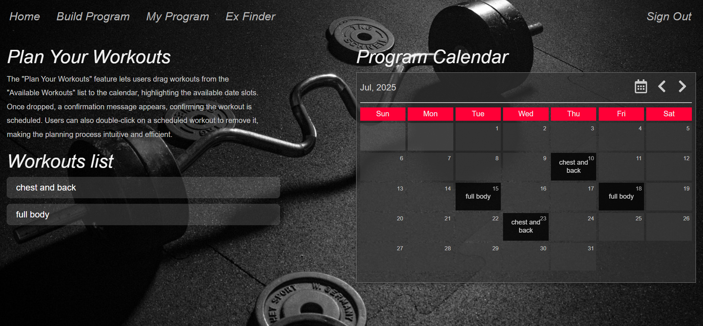
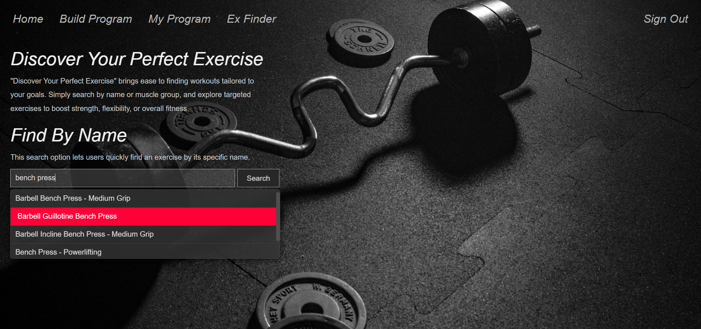
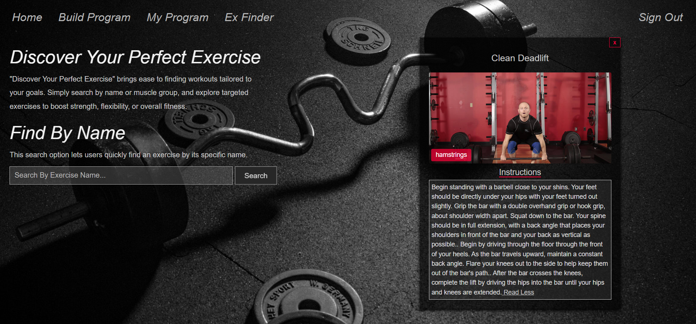

# Fitness App

A React-based fitness application that allows users to register, browse exercises, and track their workouts.

## Features

- User registration and authentication  
- Browse and search for exercises  
- Responsive design for mobile and desktop  
- Interactive UI with React  
- Backend API with Node.js and Express  
- Data stored in MongoDB  

## Screenshots

### Home Page  

### Registration Form  

### Login Form  

### Build Program List  

### My Program List  

### Exercise Searcher  

### Exercise Tab  

## Technologies Used

- React  
- Node.js  
- Express  
- MongoDB  

## Installation

1. Clone the repository  
      `git clone https://github.com/roeymalka1411/fitnessApp.git`

2. Install frontend dependencies
      `cd fitnessApp/my-app/client`
      `npm install`

3. Install backend dependencies
      `cd fitnessApp/my-app/server`
      `npm install`

4. Create a .env file inside the server folder with your MongoDB connection string:
      `MONGODB_URI=your_mongodb_connection_string`

## Running the Application
   Backend (API server)
   From the server directory, run:
      `npm run dev`
   
   Frontend (React app)
   From the client directory, run:
      `npm run dev`

The React app will usually be available at http://localhost:3000.